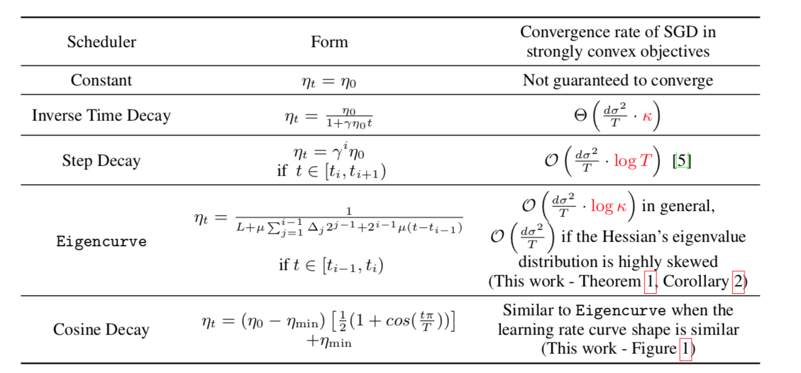
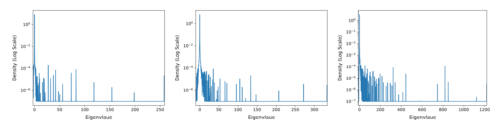
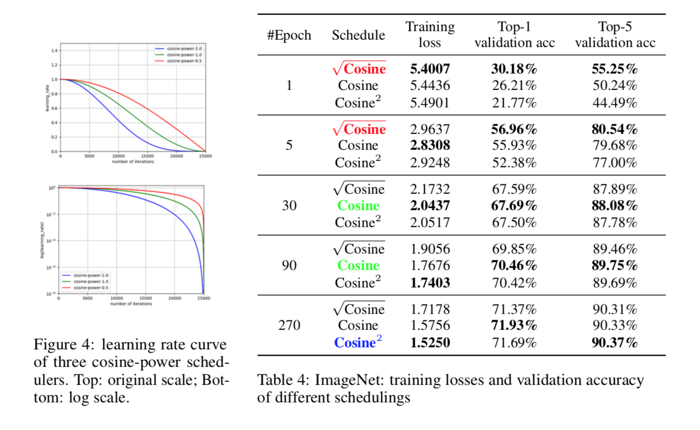

# Why Cosine Learning Rate Scheduler Works and How to Improve It?

**Reach lower bound if the Hessian eigenvalue distribution is highly skewed.**



**Estimated eigenvalue distribution of Hessian of GoogLeNet/VGG16 in CIFAR-10
and ResNet-18 in ImageNet: highly skewed.**



**Observation: Less epochs, more concave learning rate schedulers.**



## Dependency

All code are implemented in Python. One can install the dependency as follows,

```sh
pip install -r requirements.txt
```

## ===== CIFAR-10 with 10 Epochs

All codes are stored in branch "cifar10-10-epochs", please checkout to that
branch first.

```sh
git checkout cifar10-10-epochs
```

An alternative is to download the code of that branch to run this part of the
experiments.

```
https://github.com/opensource12345678/why_cosine_works/tree/cifar10-10-epochs
```

### Grid Search Based on Validation Accuracy

This part of the code requires the support of GPU.

```sh
# Validation scripts that performs grid search
./cifar10_resnet18_val.sh
./cifar10_googlenet_val.sh
./cifar10_vgg16_val.sh

# Collect results with best validation accuracy
./collect_val_results.sh
```

### Test on Searched Hyperparameters

`cifar10_resnet18_test.sh`/`cifar10_googlenet_test.sh`/`cifar10_vgg16_test.sh`
have almost same structures as the validation scripts. Modify the corresponding
hyperparameters in the script and run,

```
# Test scripts that test the model on searched hyperparameters
./cifar10_resnet18_test.sh
./cifar10_googlenet_test.sh
./cifar10_vgg16_test.sh

# Collect test results
./collect_test_results.sh
```

Please contact the author if there are any questions.


## ===== CIFAR-10 with 100 Epochs

All codes are stored in branch "cifar10-100-epochs", please checkout to that
branch first.

```sh
git checkout cifar10-100-epochs
```

An alternative is to download the code of that branch to run this part of the
experiments.

```
https://github.com/opensource12345678/why_cosine_works/tree/cifar10-100-epochs
```

Other parts are exactly the same as "CIFAR-10 with 10 Epochs".

## ===== ImageNet

All codes are stored in branch "imagenet", please checkout to that
branch first.

```sh
git checkout imagenet
```

An alternative is to download the code of that branch to run this part of the
experiments.

```
https://github.com/opensource12345678/why_cosine_works/tree/imagenet
```

### ----- Data Preparation

#### Download ImageNet Data

Before running this part of experiments, one has to download data from
[ImageNet ILSVRC2012](https://image-net.org/challenges/LSVRC/2012/) first.
Notice that successful download requires registrating an account in that
website and verifying the institute after registration.

After obtaining a verified account, one can download the [Training
set](https://image-net.org/data/ILSVRC/2012/ILSVRC2012_img_train.tar) and
[Validation
set](https://image-net.org/data/ILSVRC/2012/ILSVRC2012_img_val.tar).

#### Preprocess ImageNet Data

The downloaded data has to be uncompressed, preprocessed and put under
`data/ImageNet` in following directory structures/formats,

```sh
data/ImageNet/
|- train/
  |- n01440764
    |- n01440764_10026.JPEG
    |- n01440764_10027.JPEG
    |- n01440764_10029.JPEG
    |- n01440764_10040.JPEG
    ...
    |- n01440764_9981.JPEG
  |- n01443537
  ...
  |- n15075141
|- val/
  |- n01440764
    |- ILSVRC2012_val_00000293.JPEG
    |- ILSVRC2012_val_00002138.JPEG
    ...
    |- ILSVRC2012_val_00048969.JPEG
  |- n01443537
  ...
  |- n15075141
```

For those who are not familiar with this process, please follow the next
instructions step by step,

**Step 1:** Put the download `ILSVRC2012_img_train.tar` and
`ILSVRC2012_img_val.tar` under certain directory.

```sh
# Assumes that you are under the main directory `why_cosine_works/`
mkdir -p data/ImageNet/
mv ILSVRC2012_img_train.tar data/ImageNet/
mv ILSVRC2012_img_val.tar data/ImageNet/
cd data/ImageNet/

# Uncompresses those files
tar -xvf ILSVRC2012_img_train.tar -C train
tar -xvf ILSVRC2012_img_val.tar -C val

# After uncompression, you will see a bunch of ".tar" files under `train/` and
# a bunch of ".JPEG" files under `val/`
```

**Step 2:** Prepare the training set. We have included a script `extract.sh`
under `data/ImageNet/` to facilitate this process.

```sh
# Assumes that you are currently under the directory `why_cosine_works/data/ImageNet/`
chmod +x extract.sh
cd train
for tar in *.tar;  do sh ../extract.sh $tar; done

# The second command takes about 1h to finish. After it completes, the "train/"
# should be organized with the desired structured.
cd ..
```

**Step 3:** Prepare the validation set. This task majorly involves putting
".JPEG" files in directories named with their corresponding labels.
Fortunately, thanks to soumith, we have an available a script for this tedious
task. One may refer to [the
script](https://github.com/soumith/imagenetloader.torch/blob/master/valprep.sh)
for the content if interested.

```sh
# Assumes that you are currently under the directory `why_cosine_works/data/ImageNet/`

# Obtains the script for preprocessing validation set via wget
wget https://raw.githubusercontent.com/soumith/imagenetloader.torch/master/valprep.sh

# Runs the script
chmod +x valprep.sh
cd val
../valprep.sh

# The script should take less than 10mins to finish. After it completes, the
# "val/" should be oragnized with the disired structure.
```

### ----- Training and Results Collection

With prepared data, two scripts are used for generating the imagenet results.
`run_imagenet.sh` trains the resnet-18 model with different cosine-power
scheduler, which assumes the existence of at least two GPU cards.

After it finished, run `collect_results.sh` to collect info from log files.

```sh
./run_imagenet.sh
# Should take at least three weeks in two NVIDIA GeForce 2080 Ti cards

./collect_results.sh
# Should take less than 1mins
```

## ===== Ridge Regression in a4a

All codes are stored in branch "ridge-regression", please checkout to that
branch first.

```sh
git checkout ridge-regression
```

An alternative is to download the code of that branch to run this part of the
experiments.

```
https://github.com/opensource12345678/why_cosine_works/tree/ridge_regression
```

Two scripts are used for generating the ridge regression results.
`ridge_regression.sh` provides the grid search process. After it finished, run
`collect_ridge_regression_stat.sh` to collect info from log files.

```sh
./ridge_regression.sh
./collect_ridge_regression_stat.sh 1
./collect_ridge_regression_stat.sh 5
./collect_ridge_regression_stat.sh 25
./collect_ridge_regression_stat.sh 250
```

## ===== Modified PyHessian

All aboved experiments use the generated eigenvalue distribution of Hessian,
which is already provided without the need to run PyHessian. This part of the
code is only for checking and reviewing, where we made some modifications
to make the commandline interface of PyHessian more flexible.

All codes are stored in branch "pyhessian", please checkout to that
branch first.

```sh
git checkout pyhessian
```

An alternative is to download the code of that branch to check the code.

```
https://github.com/opensource12345678/why_cosine_works/tree/pyhessian
```
